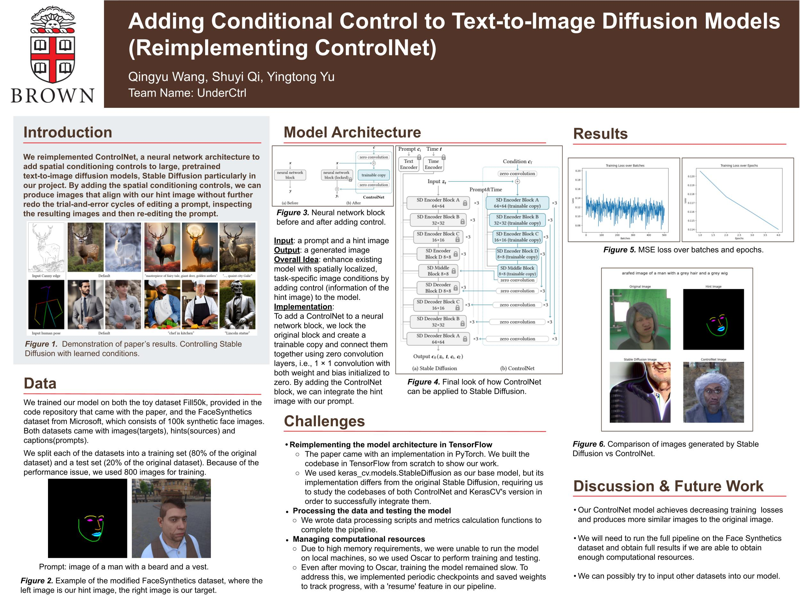

# UnderCtrl

## Poster

The poster is shown as follows. You can also view through the [link](https://docs.google.com/presentation/d/14GU204uFe8rfL5a4G3KywmDgZgvcrVceM4aWlyR2L_A/edit?slide=id.g356d2b38152_0_251&pli=1#slide=id.g356d2b38152_0_251) here.





## Final Writeup

[Here](https://docs.google.com/document/d/1PJuSbflkGeQhEvMTdsGD9vPKli0-45zmXOs5r5Xqr_s/edit?tab=t.0) is our writeup.

## Check-in Writeups

[Second Check-in](https://docs.google.com/document/d/1_R167YI9wGU-Pzgc4ddqHDkIOoqUsvMuh1qihjykSVk/edit?usp=sharing)

[Third Check-in](https://docs.google.com/document/d/1XVYoWyP1L2iDAooOcKyC1IbdhGMYS4KNO-vxa6Cq6Go/edit?usp=sharing)

## Environment for Oscar
```
python3 -m venv ~/controlnet-env
source ~/controlnet-env/bin/activate
pip install -r requirements.txt
```

## Dependencies

Reuse stable diffusion in keras_cv.

[Source Code](https://github.com/keras-team/keras-cv/tree/master/keras_cv/src/models/stable_diffusion)

[Fine-tuning Example](https://keras.io/examples/generative/finetune_stable_diffusion/)

[Original Pytorch Implementation](https://github.com/lllyasviel/ControlNet)


## Model architecture

The `ControlNet` class and `ControlledUnetModel` class are implemented based on `DiffusionModel` class in [source code](https://github.com/keras-team/keras-cv/blob/master/keras_cv/src/models/stable_diffusion/diffusion_model.py#L22). These 2 classes correspond to classes with the same name in [original implementation](https://github.com/lllyasviel/ControlNet/blob/main/cldm/cldm.py) of ControlNet.

`ControlSDB` is now the wrapper.
